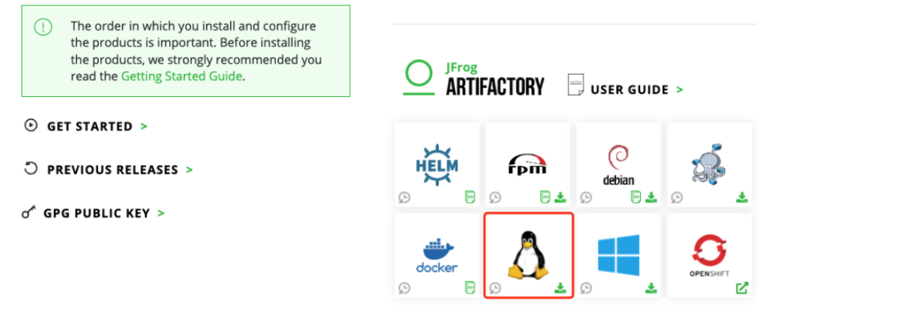

# Linux Archive 方式安装 Artifactory 单点

## 下载安装包  
**1. 安装包下载地址：**  
[https://jfrog.com/download-jfrog-platform/](https://jfrog.com/download-jfrog-platform/)  
  
您可下载最新版或指定历史版本（建议安装最新版）。   

您也可在服务器上直接下载安装包，以 7.71.11 为例：
```bash
wget https://releases.jfrog.io/artifactory/artifactory-pro/org/artifactory/pro/jfrog-artifactory-pro/7.71.11/jfrog-artifactory-pro-7.71.11-linux.tar.gz
```

**2. 创建安装目录，并解压安装包：**  
(安装路径以 /root/jfrog/ 为例)
```bash
mkdir /root/jfrog
mv jfrog-artifactory-pro-7.71.11-linux.tar.gz /root/jfrog/
cd /root/jfrog
tar -xvf jfrog-artifactory-pro-7.71.11-linux.tar.gz
mv artifactory-pro-7.71.11 artifactory
```

**3.配置数据库：**  
(可选。以 MySQL 为例, 其他配置参考 [**《Artifactory 安装 \- 数据库配置》**](https://www.jfrogchina.com/docs/artifactory-install-db/))  
如当前没有数据库，通过如下语句创建：
```sql
CREATE DATABASE artdb CHARACTER SET utf8 COLLATE utf8_bin;
CREATE USER 'artifactory'@'%' IDENTIFIED BY 'password';
GRANT ALL on artdb.* TO 'artifactory'@'%';
FLUSH PRIVILEGES;
```

下载 MySQL jdbc jar 包，并拷贝至 /root/jfrog/artifactory/var/bootstrap/artifactory/tomcat/lib/:  
(下载地址：[https://dev.mysql.com/downloads/connector/j/](https://dev.mysql.com/downloads/connector/j/)), 如：
```bash
wget https://downloads.mysql.com/archives/get/p/3/file/mysql-connector-java-8.0.13.tar.gz
tar zxf mysql-connector-java-8.0.13.tar.gz
cp mysql-connector-java-8.0.13/mysql-connector-java-8.0.13.jar /root/jfrog/artifactory/var/bootstrap/artifactory/tomcat/lib/
```

修改数据库配置：  
编辑配置文件 /root/jfrog/artifactory/var/etc/system.yaml, 添加 database 部分，完整示例如下:
```yaml
configVersion: 1
shared:
    node:
        id: "art1"
        ip: "192.168.56.13"
    database:
        type: mysql
        driver: com.mysql.jdbc.Driver
        url: "jdbc:mysql://192.168.56.13:3306/artdb?characterEncoding=UTF-8&elideSetAutoCommits=true&useSSL=false"
        username: artifactory
        password: password
```
说明：   
shared.node.id:  自定义，如 art1, art2…   
shared.node.ip:  本机 IP, 如 192.168.56.13   

**4. 配置存储**  
(可选。以 本地存储 为例, 如不配置，默认存储在安装目录 /root/jfrog/artifactory/data/，其他存储方式请参考[**《Artifactory 安装 \- 存储配置》**](https://www.jfrogchina.com/docs/artifactory-install/))  
编辑配置文件 /root/jfrog/artifactory/var/etc/artifactory/binarystore.xml, 添加以下部分:
```xml
<?xml version="1.0" encoding="UTF-8"?>
<config version="1">
    <chain template="file-system"/>
    <provider id="file-system" type="file-system">
        <fileStoreDir>/var/opt/jfrog/data/filestore</fileStoreDir>   
    </provider>
</config>

```
说明：  
fileStoreDir: 二进制文件存储实际目录, 请根据实际路径进行配置  

**5. 启动 Artifactory**
```bash
/root/jfrog/artifactory/app/bin/artifactoryctl start
```

**6. 检查日志**
```bash
tail -f /root/jfrog/artifactory/var/log/console.log
```

日志有如下输出，启动成功：
```text
###############################################################
###   All services started successfully in 50.958 seconds   ###
###############################################################
```

**7. 访问页面**  
[http://192.168.56.13:8082](http://192.168.56.13:8082)  
默认用户名密码: admin/password  
  

提示：  
进入页面后需填写 License，您可联系 JFrog 商务以获取。
